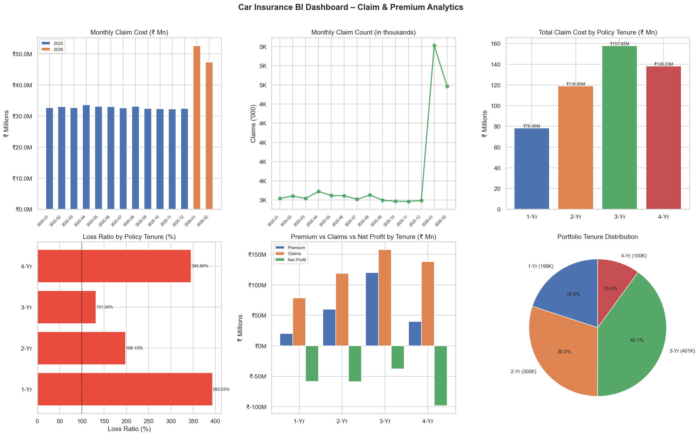
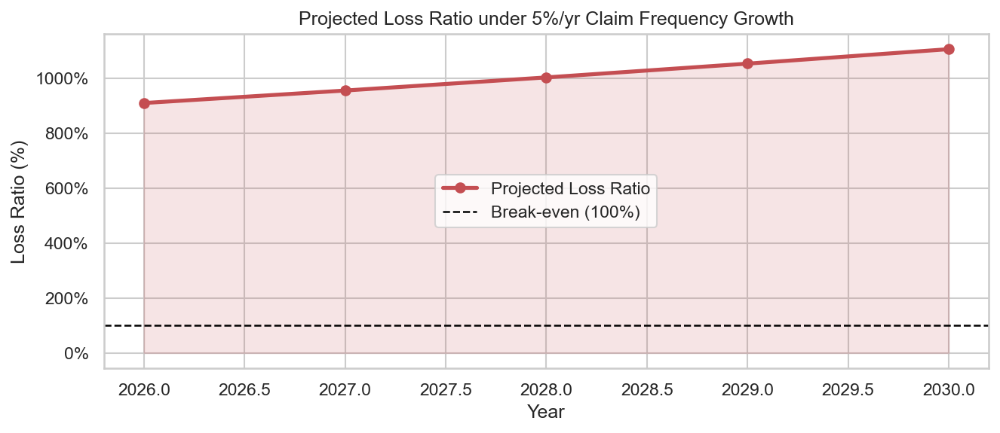

# Zooper BI Internship Assignment – Car Insurance Data Simulation & Analytics
**Submitted by:** Sandeepan Chakraborty  
**Assignment:** Car Insurance – Data Simulation & Analytics  
**Tools Used:** Python (pandas, numpy, matplotlib, seaborn), Jupyter Notebook  
**Date:** March 10, 2026
---
## Overview
This project simulates a car insurance portfolio of **1 million policies** sold in 2024 and analyses the resulting claims activity in 2025 and 2026. The goal is to answer a series of analytical queries and produce visualisations that give a Business Intelligence perspective on premium collection, claim trends, loss ratios, and future risk projections.
---
## Repository Structure
| File | Description |
|------|-------------|
| `BI_Insurance_Assignment.ipynb` | Main Jupyter notebook — data simulation, all analytical queries, and visualisations |
| `Policy_Sales_Data.csv` | 1,000,000 policy records for the year 2024 |
| `Claims_Data.csv` | All 2025 and 2026 claim records (with `Claim_Type`) |
| `BI_Dashboard.png` | 6-panel analytics dashboard (claim trends, loss ratios, tenure mix) |
| `Loss_Ratio_Projection.png` | 5-year loss ratio forecast under 5 % annual claim-frequency growth |
| `Approach_and_Insights.md` | Detailed write-up of approach, assumptions, and key insights |
---
## Dataset Description
### Policy Sales Data (`Policy_Sales_Data.csv`)
| Column | Description |
|--------|-------------|
| `Customer_ID` | Unique customer identifier (e.g. `CUST0000001`) |
| `Vehicle_ID` | Unique vehicle identifier (e.g. `VEH0000001`) |
| `Vehicle_Value` | Fixed at ₹1,00,000 for every record |
| `Policy_Tenure` | 1, 2, 3, or 4 years (distributed 20 / 30 / 40 / 10 %) |
| `Premium` | ₹100 × Policy_Tenure |
| `Policy_Purchase_Date` | Date the policy was purchased (evenly distributed across all 366 days of 2024) |
| `Policy_Start_Date` | Purchase date + 365 days |
| `Policy_End_Date` | Start date + tenure in full years |
### Claims Data (`Claims_Data.csv`)
| Column | Description |
|--------|-------------|
| `Claim_ID` | Unique claim identifier |
| `Customer_ID` | Links back to Policy Sales Data |
| `Vehicle_ID` | Links back to Policy Sales Data |
| `Claim_Amount` | Fixed at ₹10,000 (10 % of vehicle value) |
| `Claim_Date` | Date the claim was filed |
| `Claim_Type` | `1` = first-time claimant; `2` = repeat claimant (also filed in 2025) |
---
## How to Run
### Prerequisites
```bash
pip install pandas numpy matplotlib seaborn jupyter
```
### Launch the notebook
```bash
jupyter notebook BI_Insurance_Assignment.ipynb
```
Run all cells from top to bottom. The notebook will:
1. Generate the Policy Sales dataset (1 million rows).
2. Build the 2025 and 2026 Claims datasets.
3. Answer all analytical queries (total premium, claim counts, loss ratios, earned premium, etc.).
4. Produce and save the dashboard (`BI_Dashboard.png`) and loss-ratio projection (`Loss_Ratio_Projection.png`).
> **Note:** Generating the full 1-million-row dataset takes a couple of minutes on a typical laptop. The CSV files are already committed so you can skip regeneration and load them directly.
---
## Key Analytical Questions Addressed
1. Total premium collected in 2024, broken down by tenure bucket.
2. Number of vehicles eligible for a 2025 claim (purchased on the 7th, 14th, 21st, or 28th of any month).
3. Count and total cost of 2025 claims (30 % random sample of eligible vehicles).
4. Count and cost of 2026 claims (10 % of 4-year-tenure policies, spread evenly over Jan 1 – Feb 28, 2026).
5. Identification of repeat claimants (`Claim_Type = 2`).
6. Earned premium calculation as of February 28, 2026, by tenure bucket.
7. Loss ratio by tenure segment (both actual and projected).
8. 5-year loss-ratio forecast assuming 5 % annual growth in claim frequency.
---
## Visualisations
### BI Dashboard

A 6-panel dashboard covering:
- Monthly claim volume in 2025
- Claim distribution by tenure
- Total premium vs total claims by tenure
- Loss ratio by tenure segment
- Daily claim activity in early 2026
- Repeat vs first-time claimant split
### Loss Ratio Projection

A 5-year forward forecast (2025–2030) of the portfolio loss ratio assuming a 5 % annual increase in claim frequency with premiums held constant.
---
## Key Insights
| # | Insight |
|---|---------|
| 1 | **Total premium ~₹2.4 Crore** — 3-year tenure contributes the most by volume. |
| 2 | **2025 claims are the dominant cost driver** — ~39,000+ claims at ₹10,000 each across all months. |
| 3 | **2026 activity is smaller but concentrated** — ~10,000 claims in just 59 days. |
| 4 | **3-year policies are most profitable in absolute terms; 1-year policies have the best loss ratio.** |
| 5 | **4-year policies carry the most risk** — exposed to both 2025 and 2026 claim events. |
| 6 | **Loss ratios exceed 100 %** by design — a single ₹10,000 claim consumes 100 × the ₹100 annual premium. |
| 7 | **Significant unrealised liability remains** — millions of active policies have never filed a claim. |
| 8 | **5 % annual frequency growth worsens the loss ratio every year** without a corresponding premium revision. |
For the full narrative see [`Approach_and_Insights.md`](Approach_and_Insights.md).
---
## Assumptions
- 2024 is treated as a **leap year (366 days)**; policies are distributed as evenly as possible (difference of at most 1 per day).
- `Policy_Start_Date = Purchase_Date + 365 calendar days`; `Policy_End_Date` uses `DateOffset(years=n)` to handle year boundaries correctly.
- 2025 claim date = `Policy_Start_Date` exactly ("filed on the first date of policy start").
- 2026 claimants are spread evenly across Jan 1 – Feb 28, 2026 (base + remainder logic).
- Claim amount = ₹10,000 (10 % of ₹1,00,000 vehicle value) for every claim.
- Earned premium uses a **daily proration** method.
---

